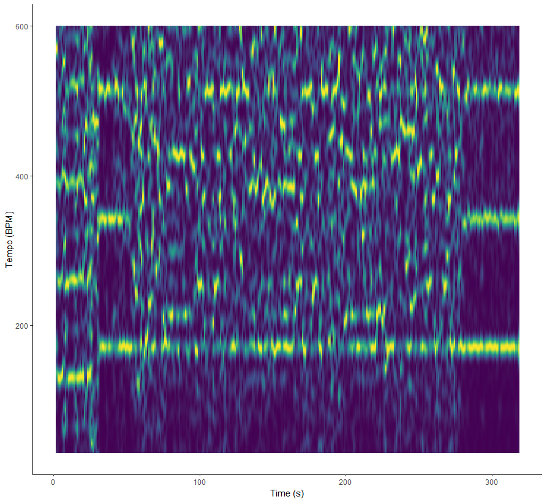

```{r setup, include=FALSE}
knitr::opts_chunk$set(echo = TRUE)
```


```{r, echo=FALSE}
library(tidyverse)
library(spotifyr)
library(compmus)
```


```{r, echo=FALSE}
old_eminem <- get_playlist_audio_features("", "5PBz3jgj5iuA3PiuTVGsxG")
new_eminem <- get_playlist_audio_features("", "0v811iPSKNOI5mbNaOWz6D")
mix_eminem <- get_playlist_audio_features("", "4HhyZv3oqk7GDyHIQ3JqAs")
```


```{r, echo=FALSE}
old_eminem_stats <- old_eminem |>
  summarise(
    mean_speechiness = mean(speechiness),
    mean_acousticness = mean(acousticness),
    mean_liveness = mean(liveness),
    sd_speechiness = sd(speechiness),
    sd_acousticness = sd(acousticness),
    sd_liveness = sd(liveness),
    median_speechiness = median(speechiness),
    median_acousticness = median(acousticness),
    median_liveness = median(liveness),
    mad_speechiness = mad(speechiness),
    mad_acousticness = mad(acousticness),
    mad_liveness = mad(liveness),
    mean_dancebility = mean(danceability),
    mean_track_popularity = mean(track.popularity),
    mean_loudness = mean(loudness),
    mean_energy = mean(energy),
    sd_tempo = sd(tempo)
  )
```


```{r, echo=FALSE}
new_eminem_stats <-new_eminem |>
  summarise(
    mean_speechiness = mean(speechiness),
    mean_acousticness = mean(acousticness),
    mean_liveness = mean(liveness),
    sd_speechiness = sd(speechiness),
    sd_acousticness = sd(acousticness),
    sd_liveness = sd(liveness),
    median_speechiness = median(speechiness),
    median_acousticness = median(acousticness),
    median_liveness = median(liveness),
    mad_speechiness = mad(speechiness),
    mad_acousticness = mad(acousticness),
    mad_liveness = mad(liveness),
    mean_dancebility = mean(danceability),
    mean_track_popularity = mean(track.popularity),
    mean_loudness = mean(loudness),
    mean_energy = mean(energy),
    sd_tempo = sd(tempo)
  )
```


```{r, echo=FALSE}
mix_eminem_stats <-mix_eminem |>
  summarise(
    mean_speechiness = mean(speechiness),
    mean_acousticness = mean(acousticness),
    mean_liveness = mean(liveness),
    sd_speechiness = sd(speechiness),
    sd_acousticness = sd(acousticness),
    sd_liveness = sd(liveness),
    median_speechiness = median(speechiness),
    median_acousticness = median(acousticness),
    median_liveness = median(liveness),
    mad_speechiness = mad(speechiness),
    mad_acousticness = mad(acousticness),
    mad_liveness = mad(liveness),
    sd_tempo = sd(tempo)
  )
```


```{r, echo=FALSE}
all_eminem <- bind_rows(old_eminem |> mutate(category = "Old Eminem"), new_eminem |> mutate(category = "New Eminem"))
```

# Introduction
This study explores the differences in the music of Eminem, one of the most influential and successful rappers of all time. The focus will be on his studio albums, divided into two distinct periods: the albums released before 2006, referred to as "old Eminem," and those released after 2006, referred to as "new Eminem." Several events in Eminem's life are cited as contributing to the shift from "old Eminem" to "new Eminem". Many of these events took place around 2006, which is why this limit has been used in this study. In addition, not all fans were happy with this change and still hope for the return of the old Eminem. This begs the question: what exactly is the difference between the old and new Eminem?

Within this corpus, the study takes a closer look at three specific songs: "The Real Slim Shady," "Darkness," and "Jimmy Brian and Mike." "The Real Slim Shady" was released in 2000 and is considered a classic example of old Eminem's shock value rap style. "Darkness", released in 2020, represents Eminem's more political approach to rap with many double entenders."Jimmy Brian and Mike", a more recent release, is a combination of the old and new Eminem. He recorded part of this song around the year 2000 and then recorded the rest of the song in 2022.

The purpose of this research is to compare the differences in Eminem's music in these two different periods. It is expected that there will be changes in the themes and subject matter of the rap lyrics, as well as differences in the musical elements, such as tempo, energy, and mood. However, it is also expected that Eminem's signature style of clear delivery has remained the same. Through the three tracks selected for this research, which represent a cross-section of Eminem's discography, we hope to gain an even better understanding of how Eminem's music has changed over time.

# Homework week 11 {.storyboard}

### Tempogram Lose Yourself

```{r, echo=FALSE}

```

---

In this tempogram you can clearly recognize 4 different parts of the song:
- The first thirty seconds of this song are a piano intro.
- Then from the thirty seconds the beat starts, which is clearly visible in the tempogram by an increase in the BPM.
- From second 53 to 278 Eminem raps over the beat. You can see this in the tempogram as the blurring of what the exact BPM is. However, the computer still manages to find a reasonably straight line.
- After second 278 the outro of the song starts with the beat extending for another 42 seconds. The start of the outro is clearly visible by the BPM line becoming brighter again.

A few things I still want to improve:
- Computer was very slow, so I used window_size = 4 and hop_size = 1 for this tempogram. I want to add a sharper version for the final portfolio.
- I also want to add a tempogram for the other two outliers of my corpus (Campaign Speech & Jimmy, Brian and Mike).

### Tempogram Campaign Speech

### Tempogram Jimmy, Brian and Mike

# Homework Week 10 {.storyboard}

```{r, echo=FALSE}
circshift <- function(v, n) {
  if (n == 0) v else c(tail(v, n), head(v, -n))
}

#      C     C#    D     Eb    E     F     F#    G     Ab    A     Bb    B
major_chord <-
  c(   1,    0,    0,    0,    1,    0,    0,    1,    0,    0,    0,    0)
minor_chord <-
  c(   1,    0,    0,    1,    0,    0,    0,    1,    0,    0,    0,    0)
seventh_chord <-
  c(   1,    0,    0,    0,    1,    0,    0,    1,    0,    0,    1,    0)

major_key <-
  c(6.35, 2.23, 3.48, 2.33, 4.38, 4.09, 2.52, 5.19, 2.39, 3.66, 2.29, 2.88)
minor_key <-
  c(6.33, 2.68, 3.52, 5.38, 2.60, 3.53, 2.54, 4.75, 3.98, 2.69, 3.34, 3.17)

chord_templates <-
  tribble(
    ~name, ~template,
    "Gb:7", circshift(seventh_chord, 6),
    "Gb:maj", circshift(major_chord, 6),
    "Bb:min", circshift(minor_chord, 10),
    "Db:maj", circshift(major_chord, 1),
    "F:min", circshift(minor_chord, 5),
    "Ab:7", circshift(seventh_chord, 8),
    "Ab:maj", circshift(major_chord, 8),
    "C:min", circshift(minor_chord, 0),
    "Eb:7", circshift(seventh_chord, 3),
    "Eb:maj", circshift(major_chord, 3),
    "G:min", circshift(minor_chord, 7),
    "Bb:7", circshift(seventh_chord, 10),
    "Bb:maj", circshift(major_chord, 10),
    "D:min", circshift(minor_chord, 2),
    "F:7", circshift(seventh_chord, 5),
    "F:maj", circshift(major_chord, 5),
    "A:min", circshift(minor_chord, 9),
    "C:7", circshift(seventh_chord, 0),
    "C:maj", circshift(major_chord, 0),
    "E:min", circshift(minor_chord, 4),
    "G:7", circshift(seventh_chord, 7),
    "G:maj", circshift(major_chord, 7),
    "B:min", circshift(minor_chord, 11),
    "D:7", circshift(seventh_chord, 2),
    "D:maj", circshift(major_chord, 2),
    "F#:min", circshift(minor_chord, 6),
    "A:7", circshift(seventh_chord, 9),
    "A:maj", circshift(major_chord, 9),
    "C#:min", circshift(minor_chord, 1),
    "E:7", circshift(seventh_chord, 4),
    "E:maj", circshift(major_chord, 4),
    "G#:min", circshift(minor_chord, 8),
    "B:7", circshift(seventh_chord, 11),
    "B:maj", circshift(major_chord, 11),
    "D#:min", circshift(minor_chord, 3)
  )

key_templates <-
  tribble(
    ~name, ~template,
    "Gb:maj", circshift(major_key, 6),
    "Bb:min", circshift(minor_key, 10),
    "Db:maj", circshift(major_key, 1),
    "F:min", circshift(minor_key, 5),
    "Ab:maj", circshift(major_key, 8),
    "C:min", circshift(minor_key, 0),
    "Eb:maj", circshift(major_key, 3),
    "G:min", circshift(minor_key, 7),
    "Bb:maj", circshift(major_key, 10),
    "D:min", circshift(minor_key, 2),
    "F:maj", circshift(major_key, 5),
    "A:min", circshift(minor_key, 9),
    "C:maj", circshift(major_key, 0),
    "E:min", circshift(minor_key, 4),
    "G:maj", circshift(major_key, 7),
    "B:min", circshift(minor_key, 11),
    "D:maj", circshift(major_key, 2),
    "F#:min", circshift(minor_key, 6),
    "A:maj", circshift(major_key, 9),
    "C#:min", circshift(minor_key, 1),
    "E:maj", circshift(major_key, 4),
    "G#:min", circshift(minor_key, 8),
    "B:maj", circshift(major_key, 11),
    "D#:min", circshift(minor_key, 3)
  )
```

### Bar graph of keys

```{r, echo=FALSE}
ggplot(all_eminem, aes(x = key_mode, fill = category)) +
  geom_bar(position = "dodge")+
  theme(axis.text.x = element_text(angle =-90))+
  ggtitle("Difference in key usage")
```

---

Looking at this chart, most New Eminem songs have a C# major (D flat major) key, and most Old Eminem songs have an E minor key.

The different keys in which a song can be played also bring different emotions. Emotions often associated with the D flat major key are "Grief & Depressive". For an E minor key, the emotions are often "Effeminate, Amorous, Restless". The emotions that New Eminem tries to convey in his music seem to match the emotions associated with the D flat major key. His music has become more and more about sad and political events in the world and about mental problems. Old Eminem's songs were a lot more playful and upbeat; he had many songs about his daughter and wife, drugs and the rap game that often conveyed a somewhat insecure but positive mood (although certainly not always positive). These emotions do not correspond directly to the associated emotions of an E minor key, but are close.

A few things I still want to improve on this graph:
- The y-axis now shows the count of songs. I want to make this a percentage. There are a lot more New Eminem songs than Old Eminem.

### Track-level Summaries
```{r, echo=FALSE}
old_em <-
  get_playlist_audio_features(
    "thesoundsofspotify",
    "5PBz3jgj5iuA3PiuTVGsxG"
  ) |>
  slice(30:59) |>
  add_audio_analysis()

new_em <-
  get_playlist_audio_features(
    "thesoundsofspotify",
    "0v811iPSKNOI5mbNaOWz6D"
  ) |>
  slice(61:90) |>
  add_audio_analysis()

mix_em <-
  get_playlist_audio_features(
    "thesoundsofspotify",
    "4HhyZv3oqk7GDyHIQ3JqAs"
  ) |>
  add_audio_analysis()

old_new_em <-
  old_em |>
  mutate(genre = "Old Eminem") |>
  bind_rows(new_em |> mutate(genre = "New Eminem"))

all_em <-
  old_new_em |>
  bind_rows(mix_em |> mutate(genre = "Mix Eminem"))

all_em |>
  mutate(
    sections =
      map(
        sections,                                    # sections or segments
        summarise_at,
        vars(tempo, loudness, duration),             # features of interest
        list(section_mean = mean, section_sd = sd)   # aggregation functions
      )
  ) |>
  unnest(sections) |>
  ggplot(
    aes(
      x = tempo,
      y = tempo_section_sd,
      colour = genre,
      alpha = loudness
    )
  ) +
  geom_point(aes(size = duration / 60)) +
  geom_rug() +
  theme_minimal() +
  ylim(0, 5) +
  labs(
    x = "Mean Tempo (bpm)",
    y = "SD Tempo",
    colour = "Genre",
    size = "Duration (min)",
    alpha = "Volume (dBFS)"
  )
```

### Chordogram for Lose Yourself

```{r, echo = FALSE}
get_tidy_audio_analysis("6GkTKjv1XbFVdI2D8vvDPu") |>
  compmus_align(bars, segments) |>
  select(bars) |>
  unnest(bars) |>
  mutate(
    pitches =
      map(segments,
        compmus_summarise, pitches,
        method = "mean", norm = "manhattan"
      )
  ) |> 
  compmus_match_pitch_template(chord_templates, "euclidean", "manhattan") |>
  ggplot(
    aes(x = start + duration / 2, width = duration, y = name, fill = d)
  ) +
  geom_tile() +
  scale_fill_viridis_c(guide = "none") +
  theme_minimal() +
  labs(x = "Time (s)", y = "")
```

### Keygram for Lose Yourself

```{r, echo = FALSE}
get_tidy_audio_analysis("6GkTKjv1XbFVdI2D8vvDPu") |>
  compmus_align(bars, segments) |>
  select(bars) |>
  unnest(bars) |>
  mutate(
    pitches =
      map(segments,
        compmus_summarise, pitches,
        method = "mean", norm = "manhattan"
      )
  ) |> 
  compmus_match_pitch_template(key_templates, "euclidean", "manhattan") |>
  ggplot(
    aes(x = start + duration / 2, width = duration, y = name, fill = d)
  ) +
  geom_tile() +
  scale_fill_viridis_c(guide = "none") +
  theme_minimal() +
  labs(x = "Time (s)", y = "")
```


# Overview {.sidebar}

This is a sidebar to give an overview of the story.

For now its just text; input controls are next.

# Welcome to musicology {data-navmenu="Random plots"}

#### Even smaller heading

This is a list:

-   hi
-   second
-   third
-   fourth

# Histograms {data-navmenu="Random plots".storyboard}

### Speechiness
```{r, echo=FALSE}
ggplot(all_eminem, aes(x= speechiness))+
  geom_histogram(binwidth = 0.1)+
  facet_wrap(~category)
```

### Popularity
```{r, echo=FALSE}
ggplot(all_eminem, aes(x= track.popularity))+
  geom_histogram(binwidth = 5)+
  facet_wrap(~category)
```

# Scatterplot {data-navmenu="Random plots"}

```{r, echo=FALSE}
ggplot(all_eminem, aes(x= energy, y = speechiness, color = category))+
  geom_point()
```


```{r, echo=FALSE}
all_eminem_stats <- bind_rows(old_eminem_stats |> mutate(category = "Old Eminem"), new_eminem_stats |> mutate(category = "New Eminem"))
```


# One first good working page {data-icon="fa-signal"}


```{r, echo=FALSE}
ggplot(all_eminem, aes(x = track.album.release_date, y = valence, color = category, size = track.popularity))+
  geom_boxplot()+
  theme(axis.text.x = element_text(angle =-90),
        axis.title.x = element_blank())+
  ggtitle("The change in valence of Eminem's music over the years")
```

***
test for text?


# Everything else

```{r, echo=FALSE}
ggplot(all_eminem, aes(x = track.album.name, y = speechiness, color = category, size = track.popularity))+
  geom_boxplot()+
  theme(axis.text.x = element_text(angle =-90))
```

```{r, echo=FALSE}
ggplot(all_eminem, aes(x = track.album.release_date, y = speechiness, color = category, size = track.popularity))+
  geom_point()+
  theme(axis.text.x = element_text(angle =-90))
```

# Make a last page

```{r, echo=FALSE}
first_plot <- ggplot(all_eminem, aes(x = track.album.release_date, y = speechiness, color = category, size = track.popularity))+
  geom_point()+
  theme(axis.text.x = element_text(angle =-90))
```
